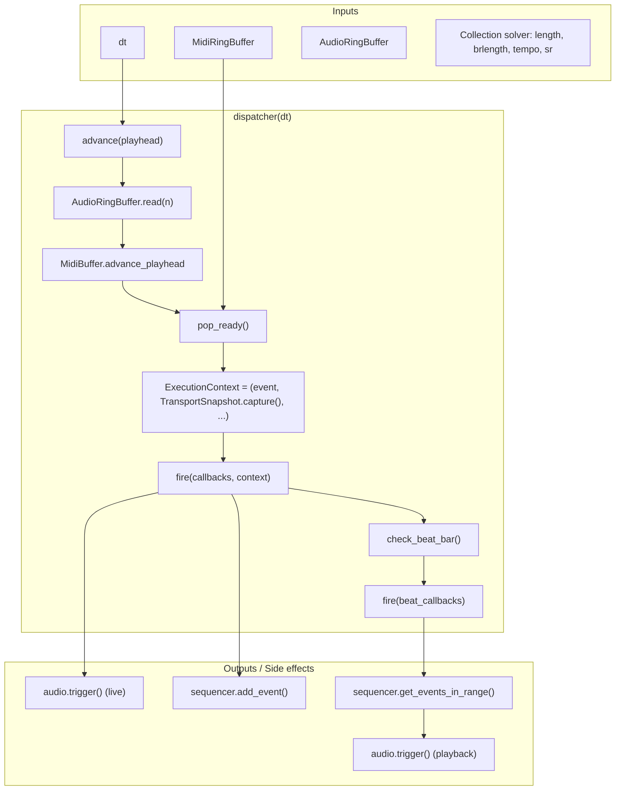

# Dispatcher Equation (Graph)

The **dispatcher** is the function that advances time, pops ready MIDI events, and fires callbacks with **late-bound** context. For a **formal** definition of the full pipeline (Timeline → Solver → Dispatcher → Event Manager) and running **over an analyzed sample** (e.g. heavenfalls.mp3), see [timeline_solver_dispatcher_spec.md](timeline_solver_dispatcher_spec.md). Conceptually:

```text
context = f(event, transport, time)
```

where `transport` and `time` are read **at execution time**, not at registration time.

---

## Collection Solver (length / bar_length / tempo)

The dispatcher needs a **collection solver**: the set of equations that relate **length** (sequence/loop length), **bar length** (beats per bar), and **tempo** (BPM) so it can advance time and decide which events are ready. **Standard of record and fixation of tempo on the beats:** See [sourcebook/tempo_fixation_standard.md](sourcebook/tempo_fixation_standard.md).

**Parameters:**

| Symbol   | Meaning                    | Example |
|----------|----------------------------|---------|
| `length` | Loop/sequence length (beats) | 16 (4 bars) |
| `brlength` | Bar length (beats per bar) | 4 (4/4) |
| `tempo`  | BPM                        | 120     |
| `sr`     | Sample rate (Hz)           | 44100   |
| `dt`     | Frame time (seconds)       | 1/60    |

**Equations:**

```text
# Time conversion (samples ↔ beats)
seconds_per_beat = 60 / tempo
samples_per_beat = sr * seconds_per_beat = sr * 60 / tempo

playhead_beats = playhead_samples / samples_per_beat
               = playhead_samples * tempo / (60 * sr)

playhead_samples = playhead_beats * samples_per_beat
                 = playhead_beats * (60 * sr) / tempo

# Frame advance
frame_samples = dt * sr
playhead_samples += frame_samples   (after read)

# Bar / beat-in-loop (for collection and loop wrap)
bars_in_loop = length / brlength
current_bar = floor(playhead_beats / brlength)
current_beat_in_bar = playhead_beats mod brlength
beat_in_loop = playhead_beats mod length
bar_in_loop = current_bar mod bars_in_loop
```

**Collection (which events are ready):**

- **MIDI buffer**: event is ready when `event.timestamp_samples <= playhead_samples`.
- **Sequencer (playback)**: events in range `[playhead_beats - ε, playhead_beats + ε]` (or `beat_in_loop` if using a fixed-length loop).

So the **solver** is: given `(length, brlength, tempo, sr, dt)` and current `playhead_samples`, compute `playhead_beats`, `current_bar`, `beat_in_loop`, and use those to advance and collect events.

**In code (engine/buffers_v2.py):**

| Solver term | EventDispatcher | AudioRingBuffer | TransportSnapshot |
|-------------|-----------------|-----------------|-------------------|
| length | `_loop_length_beats`, `set_loop_length(beats)` | — | `loop_length_beats` |
| brlength | `_beats_per_bar`, `set_beats_per_bar(n)` | — | (used in capture) |
| tempo | `_bpm`, `set_bpm(bpm)` | `_bpm`, `set_tempo(bpm)` | `bpm` |
| sr | `_sample_rate` | `_sample_rate`, `set_sample_rate(sr)` | `sample_rate` |
| samples_per_beat | `samples_per_beat` (property) | `samples_per_beat` (property) | — |
| playhead_beats | `playhead_beats` (from audio_buffer) | `playhead_beats` (property) | `beat` |
| beat_in_loop | `beat_in_loop` (property) | — | `beat_in_loop` |
| bars_in_loop | `bars_in_loop` (property) | — | `bars_in_loop`, `bar_in_loop` |

Callbacks receive `TransportSnapshot` (from `TransportSnapshot.capture(dispatcher)`), which includes `beat_in_loop`, `bar_in_loop`, `bars_in_loop`, and `loop_length_beats` for loop-aware queries.

---

## One-Frame Equation

```text
process_frame(dt) =
    advance(playhead, dt)
    → ready_events = pop_ready(MidiRingBuffer)
    → for each event in ready_events:
        context = ExecutionContext(
            event,
            transport = TransportSnapshot.capture(dispatcher),
            fire_time, latency_ms, timing_error_ms, ...
        )
        fire(callbacks, context)
    → check_beat_bar()
    → fire(beat_callbacks, current_beat, transport)
    → return fired_contexts
```

## Mermaid Graph



## Audio "Queue"

- **Live**: `event ∈ ready_events` → `fire(callbacks, context)` → callback does `audio.trigger(...)`. Queue = **MidiRingBuffer**.
- **Playback**: `beat_callbacks(beat, transport)` → `sequencer.get_events_in_range(...)` → `audio.trigger(...)`. Queue = **sequencer events**.

No separate audio command queue unless you add a scheduled-trigger queue (e.g. sample-accurate).

---

## Quad stream over any sample

The same dispatcher and collection solver can run **over any sample**: one timeline (playhead + length) drives **four streams** that all share it. The timeline can come from an internal BPM clock or from an audio file’s position and duration.

### Timeline source (one, over any sample)

**One** time driver produces `(playhead_samples, playhead_beats, length_beats)`:

| Mode | Playhead | Length | Use case |
|------|----------|--------|----------|
| **Internal** | Advance by `dt * sr` each frame; beat = samples × tempo/(60×sr) | `loop_length_beats` (e.g. 16) | Sequencer/loop without an audio file |
| **Audio file** | Position in file (samples or seconds) → map to beats via BPM or file tempo | File duration in beats | Run sequencer/events over a backing track (e.g. heavenfalls.mp3) |

So “over any sample” = the **same** solver and dispatcher run whether the timeline is a fixed BPM loop or an arbitrary audio file; you just feed playhead and length from that source.

### Quad stream (four streams, same timeline)

Four streams all read the **same** playhead and length (and thus the same `TransportSnapshot` / `beat_in_loop`):

| Stream | What it is | How it uses the timeline |
|--------|------------|---------------------------|
| **1. Live MIDI** | MidiRingBuffer + dispatcher callbacks | Events with `timestamp_samples ≤ playhead_samples` → fire with `TransportSnapshot.capture()`. |
| **2. Sequencer** | Events on the grid | `get_events_in_range(beat_in_loop ± ε)` (or `beat ± ε`); fire triggers; optional cell listeners. |
| **3. Waveform** | Audio for display | Sample buffer or file slice keyed by `[playhead_samples, playhead_samples + N]` (or beat range); same length as timeline. |
| **4. Automation / lanes** | Extra lane(s) or automation | Same `beat_in_loop` / `playhead_beats`; e.g. 4th stream = 4th sequencer lane, or a separate automation stream. |

So “quad” = four parallel streams (live input, sequencer, waveform, + one more) all driven by one timeline. They don’t need to be four separate buffers—they’re four **uses** of the same (playhead, length, tempo, bar_length).

### How to wire it

1. **Choose timeline source**
   - **Internal**: Keep current setup. `AudioRingBuffer.read(dt * sr)` advances playhead; set `dispatcher.set_loop_length(beats)`; length = loop.
   - **Audio file**: Implement a driver that (each frame) sets playhead from file position and length from file duration (in beats). Either push file samples into `AudioRingBuffer` and advance read pointer from file position, or drive a separate “playhead_samples” and sync that into the dispatcher (and optionally into the same AudioRingBuffer for waveform stream).

2. **Configure solver**
   - `set_bpm(tempo)`, `set_beats_per_bar(brlength)`, `set_loop_length(length_beats)` (or length from file duration in beats).

3. **Wire the four streams**
   - **Stream 1**: Already wired — `process_frame(dt)` pops MIDI and fires callbacks with `ExecutionContext(transport=TransportSnapshot.capture(dispatcher))`.
   - **Stream 2**: In a beat callback, use `transport.beat_in_loop` (or `transport.beat`) and `sequencer.get_events_in_range(beat_in_loop - ε, beat_in_loop + ε)`; trigger audio and cell listeners.
   - **Stream 3**: Waveform view: for the current view range, request samples from `playhead_samples` (and length) — from AudioRingBuffer or from the audio file buffer; draw using the same `beat_to_px` / TimeCamera.
   - **Stream 4**: Same `transport.beat_in_loop` / `transport.bar_in_loop` for a fourth lane or automation; same collection pattern as stream 2.

4. **Over any sample**
   - When the timeline is an audio file: length = file_duration_sec × (bpm/60) (or from file tempo); playhead = file_position_sec × (bpm/60) × sr (or equivalent). The quad stream (MIDI, sequencer, waveform, +1) then all run over that file’s timeline.

So the wiring is: **one timeline source (internal or from any sample) → collection solver (length, brlength, tempo, sr) → same playhead/length → four streams (live MIDI, sequencer, waveform, + one)**. The solver and dispatcher stay the same; only the source of playhead and length changes.
